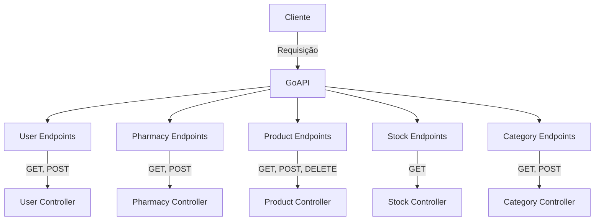

# GoAPI - Go Health API Repository

O **GoAPI** é um dos principais módulos do projeto **Go Health**, desenvolvido como parte de um Trabalho de Conclusão de Curso (TCC). Este repositório contém a API backend que gerencia as funcionalidades relacionadas à saúde, como usuários, farmácias, produtos, categorias e controle de estoque. A API foi construída para ser escalável, modular e segura, utilizando as melhores práticas de desenvolvimento.

---

## 📋 Objetivo do Projeto

O **GoAPI** tem como objetivo fornecer uma estrutura robusta para:
- Gerenciamento de dados relacionados à saúde, incluindo usuários, farmácias, produtos e categorias.
- A integração entre diferentes módulos do projeto **Go Health**.
- Processamento e fornecimento de informações para o front-end e outros serviços conectados.
- Suporte à escalabilidade e segurança em sistemas voltados para a saúde.

---

## 🛠️ Tecnologias Utilizadas

- **TypeScript**: Linguagem principal do projeto, garantindo segurança de tipos e código robusto.
- **Node.js**: Plataforma para execução do backend.
- **Express**: Framework utilizado para criação de rotas e middleware.
- **Prisma**: ORM para gerenciamento de banco de dados.
- **Swagger**: Utilizado para documentação automática dos endpoints.
- **Docker**: Utilizado para containerização e fácil implantação.
- **Jest**: Framework de testes para garantir a qualidade do código.

---

## 🚀 Endpoints Disponíveis

### **User Endpoints**
Gerencia operações relacionadas a usuários.

- **GET /user/**  
  Lista todos os usuários.  
  **Respostas**:  
  - `200`: Usuários listados com sucesso.  
  - `500`: Erro no servidor.  

- **GET /user/{id}**  
  Obtém os detalhes de um usuário específico pelo ID.  
  **Respostas**:  
  - `200`: Usuário obtido com sucesso.  
  - `404`: Usuário não encontrado.  
  - `500`: Erro no servidor.  

- **POST /user/register**  
  Registra um novo usuário.  
  **Parâmetros**:  
  - `name`, `email`, `password` no corpo da requisição.  
  **Respostas**:  
  - `201`: Usuário registrado com sucesso.  
  - `500`: Erro no servidor.  

- **POST /user/login**  
  Realiza login do usuário.  
  **Parâmetros**:  
  - `email`, `password` no corpo da requisição.  
  **Respostas**:  
  - `200`: Login realizado com sucesso.  
  - `401`: Credenciais inválidas.  
  - `500`: Erro no servidor.  

- **GET /user/logout**  
  Realiza logout do usuário.  
  **Respostas**:  
  - `200`: Logout realizado com sucesso.  

---

### **Pharmacy Endpoints**
Gerencia informações relacionadas às farmácias.

- **GET /pharmacy/**  
  Lista todas as farmácias.  
  **Respostas**:  
  - `200`: Farmácias listadas com sucesso.  
  - `500`: Erro no servidor.  

- **GET /pharmacy/{id}**  
  Obtém os detalhes de uma farmácia pelo ID.  
  **Respostas**:  
  - `200`: Farmácia obtida com sucesso.  
  - `404`: Farmácia não encontrada.  
  - `500`: Erro no servidor.  

- **POST /pharmacy/create**  
  Cria uma nova farmácia.  
  **Parâmetros**:  
  - `name`, `cep`, `email`, `phone`, `imageurl` no corpo da requisição.  
  **Respostas**:  
  - `201`: Farmácia criada com sucesso.  
  - `500`: Erro no servidor.  

- **GET /pharmacy/search/{name}**  
  Busca farmácias pelo nome.  
  **Parâmetros**:  
  - `name`: Nome da farmácia.  
  **Respostas**:  
  - `200`: Farmácias encontradas com sucesso.  
  - `404`: Nenhuma farmácia encontrada.  
  - `500`: Erro no servidor.  

---

### **Product Endpoints**
Gerencia informações relacionadas aos produtos.

- **GET /product/**  
  Lista todos os produtos.  
  **Respostas**:  
  - `200`: Produtos listados com sucesso.  
  - `500`: Erro no servidor.  

- **POST /product/create**  
  Cria um novo produto.  
  **Parâmetros**:  
  - `name`, `price`, `description`, `stock` no corpo da requisição.  
  **Respostas**:  
  - `201`: Produto criado com sucesso.  
  - `409`: Produto já existente.  
  - `500`: Erro no servidor.  

- **DELETE /product/{id}**  
  Deleta um produto pelo ID.  
  **Respostas**:  
  - `204`: Produto deletado com sucesso.  
  - `404`: Produto não encontrado.  
  - `500`: Erro no servidor.  

---

### **Stock Endpoints**
Gerencia o controle de estoque.

- **GET /stock/{pharmacy}/{product}**  
  Obtém a quantidade disponível de um produto em uma farmácia.  
  **Parâmetros**:  
  - `pharmacy`: ID da farmácia.  
  - `product`: ID do produto.  
  **Respostas**:  
  - `200`: Quantidade obtida com sucesso.  
  - `404`: Produto não encontrado.  
  - `500`: Erro no servidor.  

---

### **Category Endpoints**
Gerencia as categorias de produtos.

- **GET /category/**  
  Lista todas as categorias.  
  **Respostas**:  
  - `200`: Categorias listadas com sucesso.  
  - `500`: Erro no servidor.  

- **POST /category/create**  
  Cria uma nova categoria.  
  **Parâmetros**:  
  - `name`: Nome da categoria.  
  **Respostas**:  
  - `201`: Categoria criada com sucesso.  
  - `500`: Erro no servidor.  

---

### **Server Endpoints**
Gerencia a conexão com o servidor.

- **GET /server**  
  Testa a conexão com o servidor.  
  **Respostas**:  
  - `200`: Conexão bem-sucedida.  
  - `500`: Erro no servidor.  

---

## 🔍 Estrutura do Projeto



---

## 🔧 Como Executar o Projeto

1. **Clone o repositório**:
   ```bash
   git clone https://github.com/gohealthnow/GoAPI.git
   cd GoAPI
   ```

2. **Instale as dependências**:
   ```bash
   npm install
   ```

3. **Configure as variáveis de ambiente** no arquivo `.env`.

4. **Inicie o servidor**:
   ```bash
   npm run start
   ```

5. Acesse a API em: [http://localhost:3000](http://localhost:3000).

---

## 🧪 Como Testar

1. Execute os testes unitários e de integração:
   ```bash
   npm run test
   ```

2. Verifique os resultados nos logs.

---

## 📝 Contribuições

Contribuições são bem-vindas! Siga os passos abaixo para colaborar:
1. Faça um fork do repositório.
2. Crie uma nova branch para sua funcionalidade ou correção:  
   ```bash
   git checkout -b minha-funcionalidade
   ```
3. Envie suas alterações:  
   ```bash
   git push origin minha-funcionalidade
   ```
4. Abra um Pull Request.

---

## 📬 Contato

Para dúvidas ou suporte, entre em contato:
- **Autor**: Polabiel
- **E-mail**: bielgabrieloliveira77@gmail.com
